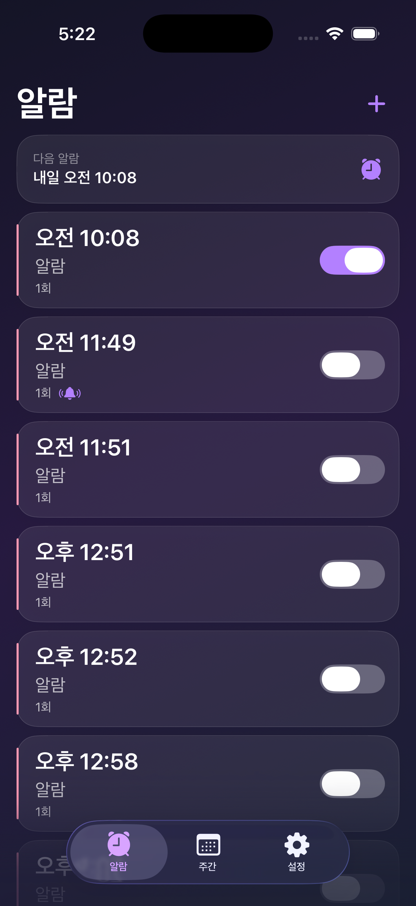
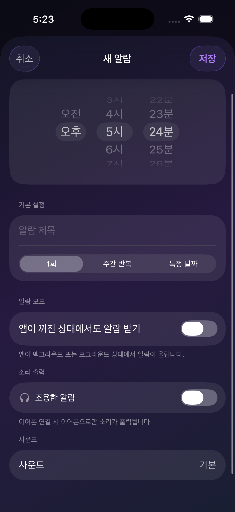
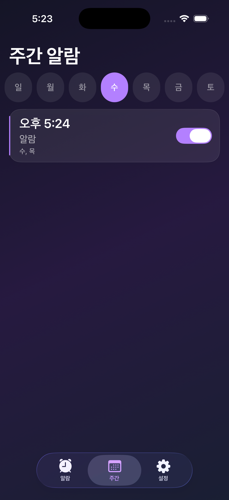
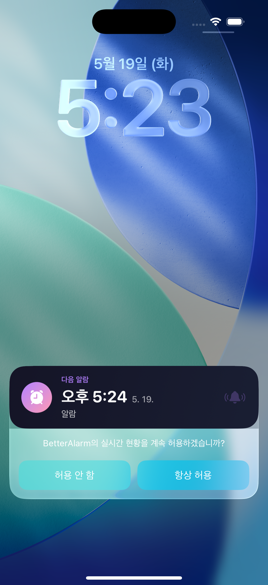
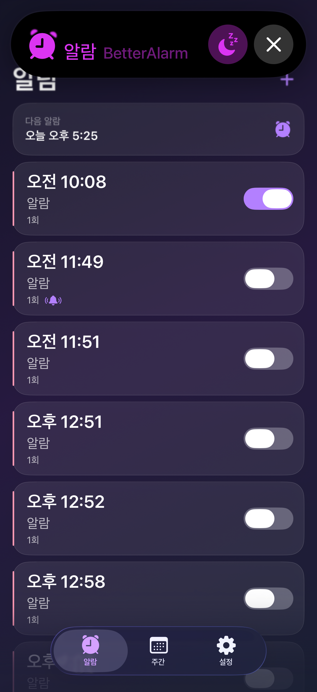
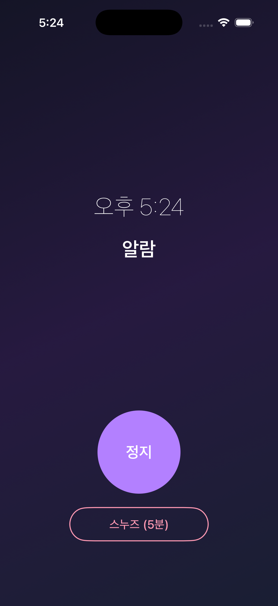
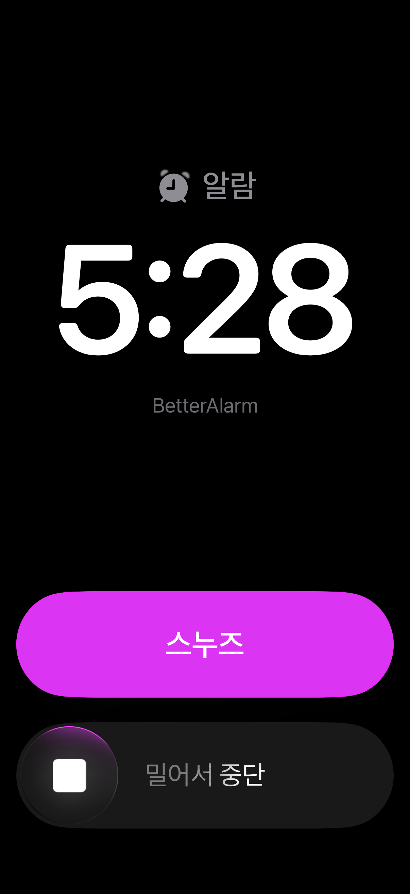

# BetterAlarm

Swift 6 + SwiftUI로 만든 iOS 알람 앱. 정확한 타이밍, 계절 테마, 잠금화면 위젯까지 지원합니다.

## 미리보기

<table>
  <tr>
    <td align="center" width="33%">
      
    </td>
    <td align="center" width="33%">
      
    </td>
    <td align="center" width="33%">
      
    </td>
  </tr>
  <tr>
    <td align="center"><b>한눈에 보는 알람 목록</b></td>
    <td align="center"><b>섬세한 알람 만들기</b></td>
    <td align="center"><b>요일별로 정리된 주간 보기</b></td>
  </tr>
  <tr>
    <td align="center">예정된 모든 알람을 한 화면에서.<br/>다음 알람이 언제 울리는지 상단에서<br/>바로 확인할 수 있어요.</td>
    <td align="center">시간 선택부터 1회·주간 반복·특정 날짜까지.<br/>"앱이 꺼진 상태에서도 알람 받기" 옵션과<br/>"조용한 알람"(이어폰 전용)도 지원합니다.</td>
    <td align="center">요일을 누르면 그 요일에 울릴 알람만<br/>깔끔하게 모아 보여줘요.<br/>일주일 일정을 한눈에 파악하세요.</td>
  </tr>
  <tr>
    <td align="center" width="33%">
      
    </td>
    <td align="center" width="33%">
      
    </td>
    <td align="center" width="33%">
      
    </td>
  </tr>
  <tr>
    <td align="center"><b>잠금화면에서 바로 확인</b></td>
    <td align="center"><b>Dynamic Island 컨트롤</b></td>
    <td align="center"><b>심플한 알람 화면</b></td>
  </tr>
  <tr>
    <td align="center">화면을 켜지 않아도 잠금화면 Live Activity로<br/>다음 알람 시간이 표시돼요.<br/>중요한 일정을 놓치지 않습니다.</td>
    <td align="center">앱을 열지 않고도 Dynamic Island에서<br/>바로 스누즈하거나 알람을 종료할 수 있어요.<br/>흐름을 끊지 않는 가장 빠른 방법.</td>
    <td align="center">알람이 울리면 큼지막한 정지 버튼과<br/>스누즈(5분)로 한 번에 처리.<br/>잠결에도 헷갈리지 않게 디자인했어요.</td>
  </tr>
  <tr>
    <td align="center" width="33%">
      
    </td>
    <td></td>
    <td></td>
  </tr>
  <tr>
    <td align="center"><b>앱이 꺼져도 알람이 울립니다</b></td>
    <td></td>
    <td></td>
  </tr>
  <tr>
    <td align="center">iOS 26 AlarmKit으로 앱을 완전히 종료해도<br/>시스템 레벨에서 알람이 울려요.<br/>안심하세요. 절대 늦지 않습니다.</td>
    <td></td>
    <td></td>
  </tr>
</table>

## 주요 기능

### 알람
- **1회 알람** / **요일 반복** / **특정 날짜** 알람
- **AlarmKit 모드** (iOS 26+): 앱을 종료해도 알람이 울림
- **로컬 모드** (iOS 17+): 포그라운드/백그라운드에서 알림으로 동작
- **스누즈** (5분) / **1회 건너뛰기** / 빠른 ON·OFF 토글

### 소리 & 볼륨
- 기본 알람음 + 커스텀 사운드(MP3) 지원
- **이어폰 전용 알람**: 연결된 이어폰으로만 소리 출력 (조용한 알람)
- **자동 볼륨 관리**: 알람 시 80% 이상 유지, 종료 후 원래 볼륨 복원

### 잠금화면 & Dynamic Island
- **Live Activity** (iOS 17+): 잠금화면에 다음 알람 표시
- **Dynamic Island**: 알람 정보를 상단에 표시
- 잠금화면에서 바로 중지/스누즈 가능

### 계절 테마
봄 / 여름 / 가을 / 겨울 — 4가지 테마 지원. 테마 변경 시 앱 아이콘도 함께 바뀝니다.

## 스크린 구성

| 탭 | 설명 |
|----|------|
| 알람 목록 | 전체 알람 목록 + 다음 알람 배너 |
| 요일별 알람 | 요일 기준 필터링 뷰 |
| 설정 | 테마 선택, 알림 권한, 잠금화면 위젯 토글 |

그 외 **알람 생성/편집** 화면, **알람 울림** 전체화면이 있습니다.

## 기술 스택

| 항목 | 내용 |
|------|------|
| 언어 | Swift 6 (Strict Concurrency) |
| UI | SwiftUI, Dark Mode 전용 |
| 아키텍처 | MVVM (`@Observable` ViewModel + `actor` Service) |
| 디자인 시스템 | [PersonalColorDesignSystem](https://github.com/KimNahun/PersonalColorDesignSystem) (Glass Morphism + Haptic) |
| 알람 | AlarmKit (iOS 26+) / UserNotifications (iOS 17+) |
| 오디오 | AVFoundation + MediaPlayer |
| 위젯 | WidgetKit + ActivityKit (Live Activity) |
| 데이터 | UserDefaults (JSON Codable) |

## 요구 사항

- iOS 17.0+
- Xcode 26+
- AlarmKit 기능은 iOS 26+ 에서만 활성화 (이하 버전은 로컬 모드로 자동 폴백)

## 빌드

```bash
xcodebuild -project BetterAlarm.xcodeproj \
  -scheme BetterAlarm \
  -destination 'platform=iOS Simulator,name=iPhone 16 Pro' \
  build
```

## 프로젝트 구조

```
BetterAlarm/
├── App/                  # 앱 진입점, TabView, DI
├── Views/                # SwiftUI 화면
│   ├── AlarmList/        # 알람 목록
│   ├── AlarmDetail/      # 생성/편집
│   ├── AlarmRinging/     # 알람 울림 전체화면
│   ├── Weekly/           # 요일별 알람
│   ├── Settings/         # 설정
│   └── Components/       # 공용 컴포넌트
├── ViewModels/           # @MainActor @Observable
├── Services/             # actor 기반 비즈니스 로직
│   ├── AlarmStore        # CRUD + 영속화
│   ├── AlarmKitService   # iOS 26+ 시스템 알람
│   ├── AudioService      # 사운드 재생
│   ├── VolumeService     # 볼륨 제어
│   └── LiveActivityManager # 잠금화면 위젯
├── Models/               # Codable & Sendable 구조체
├── Intents/              # 잠금화면 액션 (Stop/Snooze)
└── Extensions/

BetterAlarmWidget/        # 위젯 익스텐션 (Live Activity)
BetterAlarmTests/         # 유닛 + 통합 + 회귀 테스트
```

## 라이선스

Private repository.
